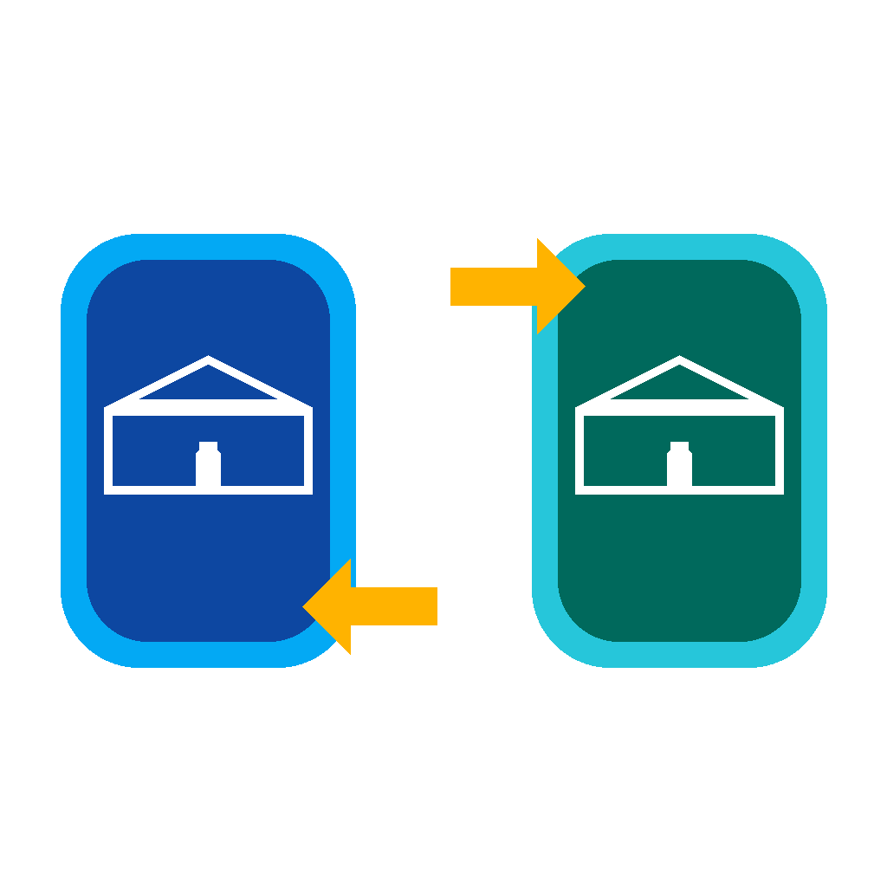

# TL Remote
   
Кастомная интеграция для [Home Assistant](https://www.home-assistant.io) · версия **1.0.0**.

| | |
|---|---|
| Домен | `tl_remote` |
| Версия | 1.0.0 |
| Тип | custom integration |
## Описание
Зеркалирование выбранных устройств между двумя инстансами Home Assistant.
### Возможности
- Сенсоры и мониторинг состояния
### Установка
1. Скопируйте папку `custom_components/tl_remote/` в каталог `custom_components/` конфигурации Home Assistant.
2. Перезапустите Home Assistant.
3. Настройки → Устройства и службы → Добавить интеграцию → **TL Remote**.
> Установка через HACS: добавьте репозиторий `https://github.com/bezuglyy/tl_remote` как Custom repository (категория Integration).
---
## Description
Mirror selected devices between two Home Assistant instances.
### Features
- Sensors and state monitoring
### Installation
1. Copy the `custom_components/tl_remote/` folder into the `custom_components/` directory of your Home Assistant configuration.
2. Restart Home Assistant.
3. Settings → Devices & Services → Add Integration → **TL Remote**.
> HACS: add `https://github.com/bezuglyy/tl_remote` as a Custom repository (category Integration).
---
**Автор / Author:**

## License / Лицензия
MIT
